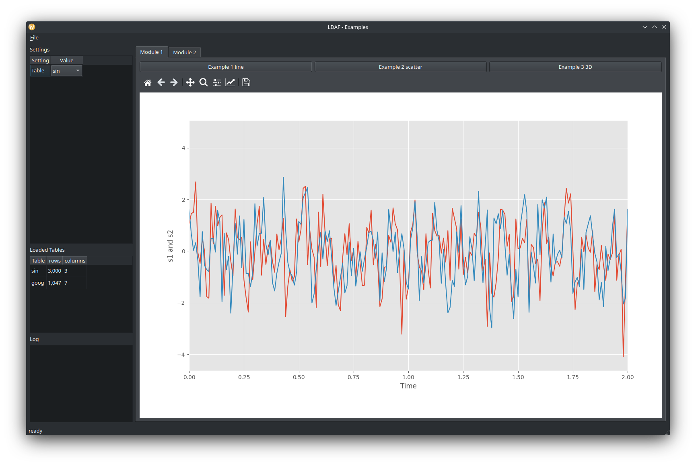

# LDAF Example

This repository provides an example application based on LDAF.

For a description of LDAF please see: https://github.com/peckto/ldaf

This example covers the following topics:

* Provide a data set
* Add custom setting
* 2D Plot (matplotlib, ggplot)
* 3D Plot (matplotlib)
* View data as table
* Add picker event


## Getting started

Clone example project:

```shell script
$ git clone https://github.com/peckto/ldaf-example
$ cd ldaf-example
```

It is recommended to use a virtual env when working with LDAF:

```shell script
$ python3 -m venv venv
```

Install dependencies:

```shell script
$ venv/bin/python -m pip install --upgrade pip
$ venv/bin/python -m pip install git+https://github.com/peckto/ldaf
```

Run

```shell script
$ venv/bin/python main.py
```

## Explanation

### Data Source

This example uses two data sets: `meet` and `goog`

```python
import pandas as pd
import numpy as np
import matplotlib.cbook as cbook
from ggplot import meat

from ldaf.DataSource import DataSource as DataSource_L


class DataSource(DataSource_L):

    def load_data(self):
        self.dfs['meat'] = meat
        
        with cbook.get_sample_data('goog.npz') as datafile:
            goog = np.load(datafile)['price_data'].view(np.recarray)

        goog = pd.DataFrame(goog)
        self.dfs['goog'] = goog

        self.app.settings.update_tables_cb()
```

### Modules
This example contains two modules: `Module_1.py`, `Module_2.py`

#### Module_1

##### example_1

This analysis function shows how to plot a figure with ggplot:

```python
def example_1(app: 'App', fig=None):
    """Example taken from:
    http://ggplot.yhathq.com/

    """
    # Get data set from data_source
    df = app.data_source.get_table('meat')

    # create ggplot figure as usual
    g = ggplot(aes(x='date', y='beef'), data=df)
    g += geom_line()

    return g
```



> :warning: The custom ggplot version does also support the picker event for scatter plots

```python
    [...]

    # enable picker for geom_point
    g += geom_point(aes(picker=True))
    
    [...]
    
    # install onpick event handler
    app.handler_f = onpick
```

##### example_2

This analysis function shows how to plot with matplotlib and how to use the picker event:

```python
def example_2(app: 'App', fig=None):
    """Example taken from:
    https://matplotlib.org/gallery/lines_bars_and_markers/scatter_demo2.html

    """
    def onpick(event):
        """matplotlib event handler for pick event

        :param event: pick event
        """
        data = df.iloc[event.ind]
        for idx, row in data.iterrows():
            app.log('Selected Date: %s' % (row['date'].to_numpy(),))

    # Get data set from data_source
    df = app.data_source.get_table('goog')
    
    [...]

    # create Axis from provided fig object
    ax = fig.add_subplot(111)

    # Plot as usual
    ax.scatter(delta1[:-1], delta1[1:], c=close, s=volume, alpha=0.5, picker=5)

    [...]

    # install onpick event handler
    app.handler_f = onpick

    # Indicate that we created a figure with matplotlib
    return 'matplotlib'
```


When interacting with the figure, the selected data is printed in the logging widget.

##### example_3

This analysis function shows how to plot a 3D figure with matplotlib:

```python
def example_3(app: 'App', fig=None):
    """Example taken from:
    https://matplotlib.org/3.1.1/gallery/mplot3d/scatter3d.html

    """
    # Create 3D figure
    ax = fig.add_subplot(111, projection='3d')
    n = 100

    # For each set of style and range settings, plot n random points in the box
    # defined by x in [23, 32], y in [0, 100], z in [zlow, zhigh].
    for m, zlow, zhigh in [('o', -50, -25), ('^', -30, -5)]:
        xs = randrange(n, 23, 32)
        ys = randrange(n, 0, 100)
        zs = randrange(n, zlow, zhigh)
        ax.scatter(xs, ys, zs, marker=m)

    ax.set_xlabel('X Label')
    ax.set_ylabel('Y Label')
    ax.set_zlabel('Z Label')

    # Indicate that we created a figure with matplotlib
    return 'matplotlib'
```


> :warning: The 3D figure does also support the picker event.

#### Module_2

##### example_1

This analysis function shows how to access the settings and to display a DataFrame as table in the UI:

```python
def example_1(app: 'App', fig=None):
    # Read setting Table from UI
    table = app.settings.get('Table')

    # Get data set from data_source
    df = app.data_source.get_table(table)

    # name attribute must be set and is displayed as title above the table
    df.name = '%s Data' % table

    return df
```


By changing the `Table` setting in the UI, the user can select the data source for this analysis function.

